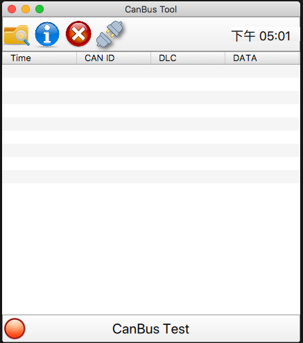

# CanBus Tool

This is canbus tool Implementation with ```PyQt5 + QML```. And it can be used in `Windows(kvaser)` or `Embedded Linux(SocketCAN)`.

## Usage

### 1-1. Run with Docker (Recommend)

You can use the docker image that we already build, as below

```bash
$ docker pull kakalin/qt:5.12.0
```
> if you want to build if from scratch, please check [here](https://github.com/kaka-lin/qt-template/tree/master/docker)

And then running with docker:

```bash
$ ./run.sh
```

### 1-2. Run with local Qt

Please install Qt/QML on your local machine.

### 2. Install needed Python Packages

```bash
$ pip3 install -r requirements.txt
```
### 3. Running the program

```bash
$ python canbus_tool.py
```

Result as below:


