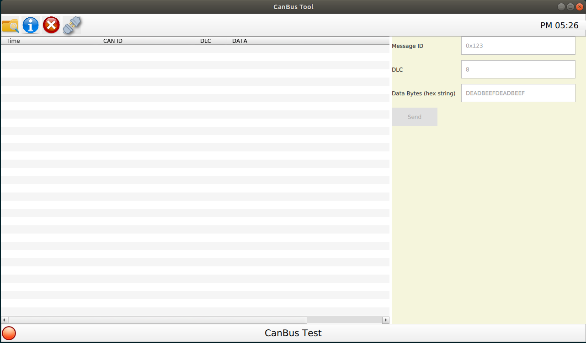

# CanBus Tool

This is a `CAN bus tool` that can send/dump CAN data.

- Frontend: The GUI is implemented with QML.
- Backend: CAN bus data headling with C/C++ (Qt) or Python (PyQt)



## Support

CAN Interface:

- [x] kvaser
- [x] SocketCAN
- [ ] pcan
- [ ] virtual

CAN bus data headling (Backend):

- Python: using [python-can](https://github.com/hardbyte/python-can) library
  - [x] dump
  - [x] send
- C/C++: using [SocketCAN API](https://www.kernel.org/doc/html/latest/networking/can.html) on Linux
  - [x] dump
  - [x] send

## Usage

### 0. Setup your CAN

Please setup your CAN devices. As SocketCAN for example:

```sh
# socketcan setup
$ sudo ip link set can0 type can bitrate 500000
$ sudo ip link set can0 up
```

> Using SocketCAN support for Kvaser interface please see:[SocketCAN Support for Kvaser Devices](https://github.com/kaka-lin/Notes/tree/master/Network/canbus/kvaser)

Through Socketcan, after finish setup you can, you will see `can0` show up by `ifconfig -a` as below:


### 1-1. Run with Docker (Recommend)

You can use the docker image that we already build, as below

```bash
$ docker pull kakalin/qt:5.12.0
```
> if you want to build if from scratch, please check [here](https://github.com/kaka-lin/qt-template/tree/master/docker)

And then running with docker:

```bash
$ ./run.sh
```

### 1-2. Run with local Qt

Please install Qt/QML on your local machine.

### 2. Choose the backend you want to use it

Going to [cpp](./cpp) or [python](./python/) folder and running it by following the related steps in the `README` file.

When you start sending/receiving can data would be like this:


